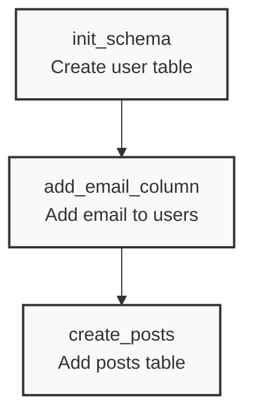

<p align="center">
  
</p>

<h1 align="center">Barmaid 🍸</h1>

<p align="center">
  <strong>Visualize your Alembic migrations with style.</strong>
</p>

<p align="center">
  <a href="#features">Features</a> •
  <a href="#installation">Installation</a> •
  <a href="#usage">Usage</a> •
  <a href="#license">License</a>
</p>

---

**Barmaid** is a lightweight, zero-dependency CLI tool that instantly converts your [Alembic](https://alembic.sqlalchemy.org/) migration history into clear, meaningful [Mermaid](https://mermaid.js.org/) flowcharts.

Database migrations can get messy. Branches, merges, and head entanglements are hard to track in your head. Barmaid helps you **see** the state of your database schema evolution at a glance.

## ✨ Features

- **🚀 Zero Dependencies**: Built with pure Python standard library. No bloat, no conflicts.
- **🌳 Complex Topography**: Flawlessly handles branches, merges, and multiple heads.
- **🕵️‍♀️ Health Checks**: Automatically detects and visually highlights orphaned revisions (missing parents).
- **🎨 Highly Customizable**: 
  - Switch orientations (Top-Down, Left-to-Right, etc.).
  - Output to file or stdout.
- **📦 Drop-in Ready**: Works with any standard Alembic folder structure automatically.

## 📦 Installation

Install directly from source:

```bash
pip install .
```

*Note: Barmaid requires Python 3.10 or higher.*

## 🚀 Usage

Navigate to your project directory and let Barmaid do the rest. It will automatically hunt for your `versions` directory.

```bash
# Generate diagram and print to stdout
barmaid
```

### Common Commands

**Save to a file:**
```bash
barmaid -o schema_evolution.mmd
```

**Change orientation (Left-to-Right):**
```bash
# Great for long, linear histories
barmaid -d LR
```

**Specify a custom versions directory:**
```bash
barmaid ./src/alembic/versions
```

### CLI Options

| Option              | Description                              | Default        |
| ------------------- | ---------------------------------------- | -------------- |
| `path`              | Path to `versions` directory             | Auto-detected  |
| `-o`, `--output`    | Save output to a file                    | stdout         |
| `-d`, `--direction` | Graph direction (`TD`, `LR`, `BT`, `RL`) | `TD`           |
| `--no-orphans`      | Hide missing parent nodes                | `True` (shown) |
| `-v`, `--version`   | Show version information                 | -              |

## 📊 Visualizing the Output

Barmaid outputs standard Mermaid syntax. You can view the diagrams in:

1.  **GitHub / GitLab**: Paste the output into any Markdown file (like a PR description or Wiki).
2.  **[Mermaid Live Editor](https://mermaid.live/)**: Copy-paste for an instant interactive preview.
3.  **VS Code**: Use the [Mermaid Preview](https://marketplace.visualstudio.com/items?itemName=bierner.markdown-mermaid) extension.

### Example Output



## 🤝 Contributing

Contributions are welcome! If you find a bug or have a feature request, please open an issue or submit a pull request.

## 📄 License

This project is licensed under the **MIT License**.
